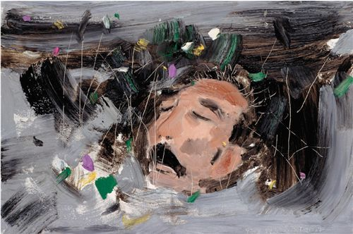

# 野草

## 题辞

当我沉默着的时候，我觉得充实；我将开口，同时感到空虚。

过去的生命已经死亡。我对于这死亡有大欢喜，因为我借此知道它曾经存活。死亡的生命已经朽腐。我对于这朽腐有大欢喜，因为我借此知道它还非空虚。

生命的泥委弃在地面上，不生乔木，只生野草，这是我的罪过。

野草，根本不深，花叶不美，然而吸取露，吸取水，吸取陈死人的血和肉，各各夺取它的生存。当生存时，还是将遭践踏，将遭删刈，直至于死亡而朽腐。

但我坦然，欣然。我将大笑，我将歌唱。

我自爱我的野草，但我憎恶这以野草作装饰的地面。

地火在地下运行，奔突；熔岩一旦喷出，将烧尽一切野草，以及乔木，于是并且无可朽腐。

但我坦然，欣然。我将大笑，我将歌唱。

天地有如此静穆，我不能大笑而且歌唱。天地即不如此静穆，我或者也将不能。我以这一丛野草，在明与暗，生与死，过去与未来之际，献于友与仇，人与兽，爱者与不爱者之前作证。

为我自己，为友与仇，人与兽，爱者与不爱者，我希望这野草的朽腐，火速到来。要不然，我先就未曾生存，这实在比死亡与朽腐更其不幸。

去罢，野草，连着我的题辞！

###### 鲁迅`1927年4月26日`记于广州之白云楼上

## 简介

1. **秋夜** `1924年9月15日`描写了两株枣树同夜空进行不屈不挠的战斗的形象，赞颂了枣树的韧性战斗精神。
2. **影的告别** `1924年9月24日`描写了深夜里为了向人来告别而出现的“影”。
3. **求乞者** `1924年9月24日`描写了“我”自己在想象中求乞的苍凉的心像风景。
4. **我的失恋** `1924年10月3日`描写了“我”失恋的经过，原因和失恋之后的痛苦、烦恼、抉择。
5. **复仇** `1924年12月20日`描写了以毫无动作对看客进行复仇这一故事。
6. **复仇（其二）** `1924年12月29日`描写了孤独的精神界战士。
7. **希望** `1925年1月1日`描写了希望与绝望的激烈矛盾。
8. **雪** `1925年1月18日`描写了南北雪景的不同，表现了作者对生活中美好事物的缅怀和对冷酷现实的抨击。
9. **风筝** `1925年1月24日`描写了故乡风筝时节的回忆和压制小兄弟放风筝的往事。
10. **好的故事** `1925年1月28日`描写了“昏沉的夜”里“我”所梦见的一幅交织着“许多美的人和美的事”的生活图画。
11. **过客** `1925年3月2日`描写了不怕艰难险阻，勇往直前的过客形象。
12. **死火** `1925年4月23日`描写了“我”要拯救死火走出冰谷的故事。
13. **狗的驳诘** `1925年4月23日`描写了“我”和狗的对话，写出狗对人的反驳，鞭挞了社会上那些比狗更势利的小人。
14. **失掉的好地狱** `1925年6月22日`描写了地狱中的“主宰”者的三次更迭经过，被统治的鬼魂越来越遭到不幸。
15. **墓碣文** `1925年6月7日`描写了自我解剖的艰难痛苦。
16. **颓败线的颤动** `1925年6月29日`描写了一个穷苦女人的悲惨的一生。
17. **立论** `1925年7月8日`描写了梦中老师所讲的一个故事和老师对于学生问题的回答。
18. **死后** `1925年7月12日`描写了对未来的疑惧。
19. **这样的战士** `1925年12月14日`描写了一个头脑清醒，坚持战斗的革命战士的形象，并热情地予以礼赞。
20. **聪明人和傻子和奴才** `1925年12月26日`描写了维护旧社会的“聪明人”、“奴才”，以及想改变旧社会的“傻子”。
21. **腊叶** `1925年12月26日`以“腊叶”自况，描写“爱我者的想要保存我”的好意。
22. **淡淡的血痕中** `1926年4月8日`描写“造物主”的怯懦。
23. **一觉** `1926年4月10日`描写了“三·一八”惨案以后青年的叛逆。

## 背景

### 文化背景

《野草》是一部充满着象征主义的散文诗集，象征主义作为一个自觉的文艺流派运动是从 19 世纪 80 年代法国作家让·莫瑞阿斯在《费加罗报》发表《象征主义宣言》时开始发展起来的，到 20 世纪 20 年代形成一个具有较大影响的世界范围的现代派文艺运动 。散文诗在新诗革命初期就开始有人创作，1918 年到 1923 年，初期白话诗人刘半农，在创作新诗的同时，写了《晓》 《饿》《雨》《静》《墨兰的海洋深处》等散文诗篇；新诗奠基者郭沫若于 1920 年 12 月 20 日，在《时事新报》副刊《学灯》上，用“我的散文诗”为总题，发表了《冬》《她与他》《女尸》《大地的号》四首短小的散文诗作品；在此前后，从 1918 年到 1924 年，《新青年》《晨报副刊》《小说月报》《文学旬刊》《文学周报》《学灯》《觉悟》《语丝》等刊物上，陆续发表了刘半农、沈颖、周作人、两谛（郑振铎）、沈性仁、张定璜、苏兆龙等人翻泽的屠格涅夫、波德莱尔的散文诗，有的刊物还专门发表了介绍和讨论散文诗的文章。作者就是在这样的文化氛围下陆续发表了 23 篇散文诗，编成《野草》。

### 时代背景

20 世纪初期，中国政治时局动荡不安，军阀混战，段祺瑞政府把持了北京政权后，中国陷入了五四运动之后最黑暗的时期。军阀政府“既摧残全国学生工人争取自由运动，惨杀无辜。又主使川湘桂粤东南东北数次战争，扰害闾阎。”五四新文化运动出现了逆转和挫折，《新青年》团体散掉后，鲁迅有种在沙漠中孤军奋战的感觉。他把自己描写成在旧战场上徘徊的余零兵卒，找不到目标和意义。而与周作人的失和以至决裂，使鲁迅极力维持的完整的家的概念不复存在，鲁迅精神家园最后的整合的依托四分五裂，再者，女师大事件也给鲁迅情绪带来很大的影响，作者鲁迅为了记述这一过程，创作了一系列反映军阀混战及内心苦闷的散文诗。

### 创作过程

这部诗集所收的 23 篇散文诗，作于 1924 年至 1926 年北洋军阀统治下的北京。作者鲁迅在 1932 年回忆说：“后来《新青年》的团体散掉了，有的高升，有的退隐，有的前进，我又经验了一回同一战阵中的伙伴还是会这么变化，并且落得一个‘作家’的头衔，依然在沙漠中走来走去，不过已经逃不出在散漫的刊物上做文字，叫作随便谈谈。有了小感触，就写些短文，夸大点说，就是散文诗，以后印成一本，谓之《野草》。”（《南腔北调集·自选集自序》。1926 年 4 月 10 日写完《一觉》后不久，作者鲁迅离开北京，南下厦门，当鲁迅从厦门赴广州时，途中有一封致北新书局李小峰的信，其中提到：“至于《野草》，此后做不做很难说，大约是不见得再做了……但要付印，也还须细看一遍，改正错字，颇费一点工夫。因此一时也不能寄上。”（《华盖集续编．海上通信》）到达广州以后，鲁迅忙于种种，整理《野草》旧稿之事暂时搁置，直到“四·一五”政变之后，鲁迅脱离了中山大学，感到“现在无话可说”，而又不便马上离开广州，于是着手整理旧稿，首先从事的就是《野草》，于 1927 年 4 月 26 日写出《题辞》，28 日将全稿寄北京李小峰，当年七月，《野草》由北京北新书局出版，《题辞》载于《野草》单行本卷首，《题辞》在诗集最初六次印刷时都曾印入；1931 年 5 月上海北新书局印第七版时被国民党书报检查机关抽去，1941 年上海鲁迅全集出版社出版《鲁迅三十年集》时才重新收入；诗集中的《英文译本序》，是应英文本《野草》的译者冯余声之请而写的，据《鲁迅日记》1932 年 11 月 2 日载：“得冯余声信，即覆。”11 月 6 日：“与冯余声信，并英文译本《野草》小序一篇，往日照像两枚。”英译本原拟在商务印书馆出版，但稍后毁于 1932 年“一·二八”上海的战火，未能印行，在 1941 年时才收入。

## 鉴赏

### 主题思想

《野草》主题思想主要分为两大类：一类是着重表现作者一贯的战斗精神的；一类是着重表现作者特定时期的内心矛盾的。就每一首散文诗具体而言，绝大多数都同时交织着这两种情绪，只是有主要和次要之分。

- 反映战斗情绪的散文诗，主要分为三个积极的主题：

  - 一是歌颂顽强勇敢的战斗精神，作者通过不同性格的反抗、战斗者形象的描写和塑造，表现了对军阀混战时期社会的反抗斗争精神。如《秋夜》通过对小粉红花、枣树和小青虫形象的描写，热情歌颂了反抗黑暗、坚持斗争，追求光明的反抗战斗精神，特别是突出歌颂了枣树不畏强敌、不受益惑、顽强勇敢的战斗精神。同广阔无边、冷酷凶残的夜空相比，枣树虽然显得势单力薄、孤独无助，而且身负内伤和外伤，但是它毫无惧色，始终“默默地铁似的直刺着奇怪而高的天空，一意要制他的死命，不管他各式各样地映着许多蛊惑的眼睛’’。在枣树的攻击下，强大的夜空终于败北。《这样的战士》描写了一位目光敏锐、经验丰富、顽强坚决、永不休战的战士。这位战士能及时识破敌人的各种伪装和诡计，在任何情况下都坚决向敌人“举起了投枪"，不打倒敌人决不罢休。其顽强坚决正与枣树的性格相同。在《死火》中塑造了在冰冷的世界里宁愿燃烧焚尽，也不愿坐以待毙的“死火"形象，表现了在斗争中求出路的精神。《腊叶》中的“枫叶”同“死火”具有同样的品格和精神，它乐意在寒霜中同深秋对立，而不愿被人封存保护，以免失去自己的固有本色。《颓败线的颤动》中的“垂老的女人”一生受尽了痛苦和屈辱，但她并不屈服，她挺起胸膛，昂起头，站起来奋然反抗这一无比黑暗、是非颠倒的罪恶世界。《一觉》中的知识青年，在残酷的现实斗争中，“灵魂被风沙打击得粗暴”了，他们觉醒了，用实际行动同军阀斗争，得到了作者的高度赞扬，宣言“我愿意在无形无色的鲜血淋漓的粗暴上接吻”。作者所描写赞扬的正是他自己一贯提倡的性格和精神，也正是他自己的精神面貌在作品中的反映。它说明作者即使处于极端矛盾和痛苦之中，仍以反抗、战斗为己任。
  - 二是揭露军阀的本质与罪行，作者着重揭露和批判了军阀势力的代表人物及其帮凶。这是作者通过散文诗的形式同军阀势力进行直接的斗争。《失掉的好地狱》描写了以暴君和刽子手面目出现的地狱统治者“人类"，这实际是现实最高军阀统治者的化身。这一统治者新上台比以往的统治者更加凶恶残忍，他得势后便立即“添薪加火，磨砺刀山，使地狱全体改观”。这深刻地说明，统治阶级的政权更迭是换汤不换药的，人民群众只会落得更加悲惨的命运，因此对任何统治统治者都不能寄予丝毫的幻想。但是作者也同时说明那些军阀统治者是既凶残又虚弱的。《淡淡的血痕中》揭露了作为统治者象征的“造物主”的这种属性：“他暗暗地使天变地异，却不敢毁灭一个这地球，暗暗地使生物衰亡，却不敢长存一切尸体，暗暗地使人类流血，却不敢使血色永远鲜裱；暗暗地使人类受苦，却不敢使人类永远记得。”这就是“造物主”凶残和怯弱的本性，他要镇压和屠杀人民，但他没有能力镇压屠杀所有的人民，他只能靠“人类中的怯弱者”的存在来维持自己的统治。如果人类中没有了“怯弱者”，那么统治者也就失去了统治的条件。因此，作者高兴地看到“叛逆的猛士出于人间”，并预言这将会使天地“变色”。此外，作者还在《狗的驳诘》中暴露了势利贪婪的“人”，在《死后》中暴露了黑暗、冷酷、悲惨、冷漠、民不聊生的社会现实。这些散文诗反映了作者对军阀统治者及其帮凶的无比痛恨。
  - 三是批判群众的麻木精神和腐朽意识。作者首先抱着“哀其不幸，怒其不争”的态度，批判了广大群众的麻木和不觉悟状态。如《复仇》中广漠上出现了一对“裸着全身，捏着利刃”的男女，他们或“将要拥抱”，或“将要杀戮”。于是人们便“从四面奔来，而且拼命地伸长脖子，要赏鉴这拥抱或杀戮”。在《复仇（其二）》中揭露和批判的是落后群众的助虐行为。其次，对小资产阶级和小市民的某些恶劣风气和腐朽意识，也进行了无情的讽刺和有力的批判。《我的失恋》是为“讽刺当时盛行的失恋诗”而作的，直接批判了文坛上的无聊风气。《求乞者》批判了在旧社会恶劣风气的影响下，某些少年的虚伪做作，逢人磕头乞讨的丑恶行为：《立论》批判了虚伪圆滑、不分是非的处世哲学；《聪明人和傻子和奴才》批判了只会诉苦而不敢反抗，甚至反对反抗的奴隶主义和奴才思想。这类批判基本上也是针对落后群众的，批判的目的是为了推动他们觉醒和前进。

- 反映作者内心矛盾的散文诗，主要分为两种主题:

  - 一是直接揭示内心矛盾的，在揭示内心矛盾的篇章中，着重反映了作者对旧我、旧的思想和旧的道路的极度不满，他要冲出樊笼，寻求新的思想和出路，但是主客观环境又还没有给他创造冲出的条件和能力，结果到处“碰壁”，“使他感到中国各处是壁，然而无形，象‘鬼打墙’一般，使你随时能‘碰’”。在《影的告别》中，作为“新我”象征的“影"不愿同象征“旧我”的“人”在一起了，经过反复和痛苦的思想斗争后，终于“独自远行”，离开了一向所依附的“人"，但是由于找不到光明和出路，最后还是“被黑暗沉没”。这里反映的正是作者痛苦、矛盾，甚至悲观、失望的情绪。为了抛弃旧思想和摆脱痛苦的心情，作者甚至试图采取硬性“离开”的办法，在《墓碣文》中，对旧思想作了否定和批判后，赶紧“疾走，不敢反顾，生怕看见他的追随”。这种做法虽然表现了同旧思想彻底决裂的态度，但是实际上也还是一种无可奈何的办法，因为这是一种盲目的、一相情愿的“离开”，前面还是没有可走的路。作者说过“人生最苦痛的是梦醒了无路可走”。
  - 二是展示某些理想和光明的。在《雪》中，作者把“江南的雪”作为一个尽善尽美的个性来塑造，尽情赞美她的美丽、纯真、无私、高尚的品格。显然，这是作者理想中的个性，她同现实中丑恶、污浊、自私、无耻的人物形成了鲜明的对照。作者希望用前者来改造和代替后者。在《好的故事》中，作者又描绘了一幅“美丽、幽雅、有趣”的生活图画。这是一个极为美好的境界，它是那么明亮、和谐、舒展、生动，它同黑暗、混乱、压抑、僵死的现实形成了鲜明的对比。这是作者理想中的社会面貌。但是由于这时作者对客观现实还缺乏全面的认识，对未来社会又毫无把握，所以他笔下的美好事物还都是十分空泛和短暂的，它们或以嫩雪的形式或以梦境的形式出现，不是好景不长就是转瞬即逝，全都顷刻幻灭。这既反映了美好理想和黑暗现实的矛盾，又反映了作者对未来毫无信心。

### 生命哲学

《野草》区别于鲁迅其它作品的一个最大的特征，是它隐藏的深邃的哲理性与传达的象征性。不满足于当时一般闲话或抒情性美文来传情达意，而将从现实和人生经验中体悟的生命哲学赋予一种美的形式，创造一种特异的“独语”式的抒情散文诗。《野草》承载的生命哲学主要表现在以下两方面。

- 韧性战斗的哲学，主要是指对于旧的社会制度与黑暗势力，对人和人性摧残压迫所采取的生命选择和心理姿态。基于对改革中国社会艰难的深刻了解，对于五四以后青年抗争黑暗势力过分乐观和急躁的观察，鲁迅以一个启蒙者独有的清醒，提出坚持长期作战的韧性哲学。他说他佩服天津青皮的“无赖精神”。他主张同敌人战斗中，要坚持“壕堑战”，尽量减少流血和牺牲，他告诉人们：“正无须乎震骇一时的牺牲，不如深沉韧性的战斗。”《野草》第一篇《秋夜》暗示的就是这个思想。《过客》中，具有这种韧性战斗精神的枣树，变成了一个倔强的跋涉者的动人形象。对于过客的形象，在他心里已酝酿了十余年的时间，用短小话剧形式写的《过客》，一致公认是《野草》的压卷之作，这里包含了鲁迅自辛亥革命以来，所经历所积蓄的最痛苦、也最冷峻的人生哲学的思考。在写完《过客》的两个月后，鲁迅在一篇文章里说：“我自己是什么也不怕的，生命是我自己的东西，所以我不妨大步走去，向着我自以为可以去的路：即使前面是深渊、荆棘、峡谷、火坑，都由我自己负责。”《这样的战士》、《淡淡的血痕中》，或是“有感于文人学士们帮助军阀而作”，或是愤慨于“段祺瑞政府枪击徒手民众”的声音，也都能在具体现实斗争事件的关注与介入中，进行诗性的想象与升华，抒发和赞美了一种永无休止、永远举起投枪的生命哲学。
- 反抗绝望的哲学，是鲁迅转向自己内心世界进行激烈搏斗的产生的精神产物。所谓“反抗绝望”并不是一个封闭世界的孤独者自我精神的煎熬与咀嚼，而是坚持叛逆抗争中感受寂寞孤独时灵魂的自我抗战与反思。它的产生与内涵，都与现实生存处境有深刻的联系。《影的告别》是《野草》中最晦涩、最阴暗的作品。假托影与形的对话，它最痛苦也是最痛快的选择，是在黑暗中无声的沉没。《乞求者》抒发了在冷漠无情的社会里，对奴隶式求乞行为的厌腻、疑心与憎恶。《希望》是将“反抗绝望”的生命哲学，表现得最充分也最直接的一篇。

### 艺术特色

- 象征主义
  1. 通过象征性的自然景物的意象和氛围，构成象征世界、暗示作者的思想和情绪，如《秋夜》、《雪》、《腊叶》等。
  2. 通过编造幻想中的真实与想象纠缠的故事，构成象征的世界，传达自己的思想和哲学，如《求乞者》、《复仇》、《复仇（其二）》、《好的故事》、《过客》等。
  3. 完全用非常荒诞的现实中不可能发生或存在的“故事”，传达或暗示自己的旨意，如《影的告别》、《死火》、《狗的驳诘》、《失掉的好地狱》、《墓碣文》、《死后》等。 [4]
- 现实主义
  《风筝》叙写“我”怀着惆怅的情绪回忆儿时对喜爱风筝的小弟弟的粗暴行为，以及成年后补过不及的悲哀。在《风筝》里，无论是北京严冬的肃杀气氛，或是故乡的风筝时节的动人景象，无论是儿时傲然摧毁弟弟制作的风筝的细节描写，或是中年以后补过不及的沉重的心理刻画，都是按照现实生活原有的样子来描绘和表现的，从而使《风筝》成为一首荡漾着淡淡哀愁的优美的现实主义诗篇。《一觉》也是一篇运用现实主义手法的作品。作者在奉天派军阀飞机的轰炸声里感受到“死”的威胁，又从青年们的文稿中窥见到他们粗暴的可爱的魂灵，而这些纯真而愤怒的青年的话动，使他感着“生”的存在，更使他惊觉，鼓舞他在漫长的人生道路上继续前进。作者在这里所展示的，依然是一幅色彩绚丽的现实主义的生括图画。
- 语言艺术
  1. 使用形象的语言，生动地、浮雕似地写出作品中人物的复杂性格，如《立论》中那市侩口里吐出一连串“啊呀！啊唷！哈哈！……”的声音，及《过客》与《聪明人和傻子和奴才》中种种人物的对话，符合于语言个性化和典型化的原则。
  2. 选择准确、鲜明的语言，表达丰富深刻的思想内容，且精致邈绵、余味无穷。如《狗的驳诘》：“我惭愧，我终于还不知道分别铜和银……还不知道……”这里只用了四十六个字，就写出了市侩主义的精神特质
  3. 善于选择生动、明朗的词句，抒写出优美、深邃的意境和境界。如《一觉》：“漂渺的名园中，奇花盛开，红颜静女正在超然无事地逍遥，鹤唳一声，白云郁然而起……”
  4. 语言丰富多采，具有中国民族的气派。鲁迅除创造性地运用了中国现代语言之外，又借助许多中国古代文学语言、佛经及外国文学的词汇，以及重词、叠句、偶句、反语、双关语和象征性的语言，来表达他的生活态度、认识，来加深散文诗的意境。
  5. 音节方面，《野草》虽不受任何格律诗的束缚，但内在韵律却很强（所谓内在韵律主要是指诗人思想感情的起伏波澜）。有的急骤高昂，气势磅礴，如《淡淡的血痕中》、《雪》等，有的盘旋往复，如《复仇（其二）》、《一觉》等，有的郁结沉闷，如《影的告别》、《希望》等，有的平静低缓，如《风筝》、《好的故事》、《腊叶》等；有的轻松活泼，如《立论》、《狗的驳诘》等。

## 影响

中国现代散文诗从 1918 年产生，到《野草》完成的 1926 年，共经历了八年的时间。经过鲁迅的努力开拓，新生的现代散文诗走过了由幼稚到成熟的一段路程。《野草》是中国现代散文诗走向成熟的第一个里程碑，是在中国现代散文诗的发展中具有开山意义的作品。《野草》将诗意和哲理相结合，为新的文学形式带来了特有的艺术光彩；它不再借助于诗的韵脚，使散文诗从新诗中完全独立出来，成为中国现代哲理散文诗的良好开端。《野草》以不虚夸、不粉饰的严峻自我解剖开阔了现代散文诗抒情艺术的道路。《野草》启示人们要把个人的诗情与整个时代的斗争紧密联系起来。《野草》开创了现代文学中象征主义道路。

## 评价

- 极其诗质的小品散文集—《野草》。这是贫弱的中国文艺园地里的一朵奇花。那里面精炼的字句和形式，作者个性和人生真实经验的表现，人间苦闷的象征，希望幻灭的悲哀，以及黑而可怖的幻景，使之想起散诗的鼻祖波德莱尔和他一卷精湛美丽的《散文小诗》来。只觉得它的美，但说不出它的所以为美。虽然有人说展开《野草》一书，便觉冷气逼人，阴森森如入古道，而且目为人生诅咒论；但这正如波德莱尔的诗集《恶之花》一样是不适合于少年与蒙昧者的诵读，但是明智的读者却能从这里得到真正希有的力量。
  ###### 现代诗人李素伯
- 《野草》的问世，为中国新文学中从未有过的散文诗立下范式，可惜后来者从之不多，未能使此一新兴的诗体得到进一步发展。
  ###### 现代诗人痖弦
- 《野草》有如《呐喊》、《彷徨》那些叙事书写作品所没有的幽深性、神秘性和永久性，它在整体上有一种难以破解而又可以永远引人沉思的艺术美的魅力。
  ###### 北京大学中文系主任孙玉石
- 个人杂感的诗意的变体。
  ###### 香港中文大学教授李欧梵
- 萌芽中的真正的诗；浸透着强烈的情感力度的形象，幽暗的闪光和奇异的线条时而流动时而停顿，正像熔化的金属尚未找到一个模子。
  ###### 近代评论家夏济安
- 幸而有这一部《野草》，还能够多多少少走进鲁迅的内心世界，能够看到鲁迅灵魂的真和深。所以《野草》是一部相对真实地揭示鲁迅个人存在的作品，多多少少揭示了鲁迅个人的真实生命状态和真实话语的存在。
  ###### 北京大学博士生导师钱理群
- 《野草》是诗，但迄今为止却还没有被真正当作诗来阅读。而严格意义上的诗学解读，应服从作品的诗学本质及诗学研究本身的规定性。
  ###### 同济大学鲁迅研究中心主任张闳
